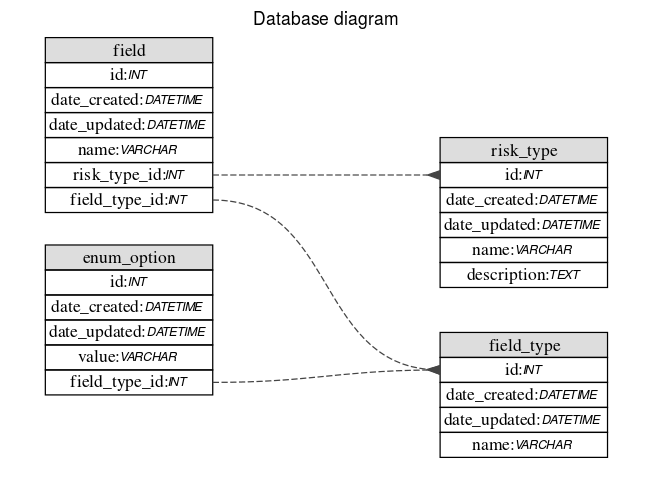

# Product Development Hiring Project

## Data

The models for the database can be found on the ORM python file [models](risker/models.py).
There's also a diagram explaining the relationships of the models/tables of the database

### Entity Models explanation

The `Risk Type` information is stored in a `risk_type` table, we save the name and description information for the risk type in this table.

A `RiskType` entity has many `Field`s entities, we store the name of the field in this entity. A `Field` entity also has one `FieldType` associated, so one `FieldType` can have multiple `Field`s. Fixtures contain examples of field types `text`, `date`, `number` and `enum`.

For the `enum` field types there's another table/entity, in which we store enum values for the field, meaning that a `FieldType` can be associated to multiple `enum` options.

## Backend

Flask was the python framework of choice for this project, the api endpoint tests can be found [here](tests/test_risker.py)

## Frontend

The API information is collected and displayed using Vuejs and Vuex for the state management, bulma.io is used to give a little style to the app. 

We have a differente Vue component for each type of field type received and so the fields are displayed according to their type.

The frontend has his own [repository](https://github.com/deathwebo/britecore-frontend) but for deployment it ended up merged and the html/js compiled is displayed through Flask (at the `/` route).

## Deployment

The app was deployed to a digital ocean ubuntu droplet.

